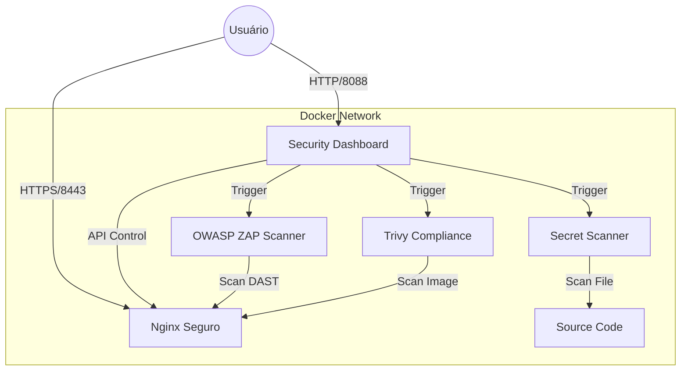

# 🛡️ Secure Container Template

> **Orquestração de Segurança Automatizada para Ambientes Docker**


Uma solução completa "In-a-Box" para implantação de aplicações web seguras. Este projeto integra as melhores práticas de hardening de servidores (Nginx) com um conjunto poderoso de scanners de vulnerabilidade (DAST, SAST e Infraestrutura), tudo gerenciado por um Dashboard centralizado.

---

## 🚀 Funcionalidades Principais

| Componente | Ferramenta | Função |
| :--- | :--- | :--- |
| **Web Server** | **Nginx** | Servidor endurecido com HSTS, CSP, e Headers de segurança forçados. |
| **App Security** | **OWASP ZAP** | Testes de penetração dinâmicos (DAST) automatizados. |
| **Infra Security** | **Trivy** | Varredura de CVEs e vulnerabilidades em imagens Docker e OS. |
| **Secret Security** | **TruffleHog** | Detecção de chaves de API e credenciais vazadas no código. |
| **Dashboard** | **Node.js** | Interface unificada para controle de scans e visualização de relatórios. |

## 🏗️ Arquitetura

O ambiente é composto por containers isolados que se comunicam através duma rede interna segura (`secure_net`).



## 📋 Pré-requisitos

- [Docker Engine](https://docs.docker.com/engine/install/) (v20.10+)
- [Docker Compose](https://docs.docker.com/compose/install/) (v2.0+)

## 🛠️ Guia de Deploy Rápido

Para iniciar todo o ecossistema de segurança (Aplicação + Scanners + Dashboard), execute apenas:

```bash
docker compose up -d --build
```

### Acessando os Serviços

Após a inicialização (aguarde ~30 segundos para o boot completo):

1.  **Aplicação Segura**: [https://localhost:8443](https://localhost:8443)
    *   *Nota: Aceite o aviso de certificado auto-assinado (ambiente de desenvolvimento).*
2.  **Dashboard de Segurança**: [http://localhost:8088](http://localhost:8088)

## 🛡️ Executando Testes de Segurança

O Dashboard centraliza todas as operações. Navegue até `http://localhost:8088` e utilize os controles:

### 1. Web Application Scan (ZAP)
Clique em **"Run ZAP Scan"**. O scanner irá:
*   Spiderar a aplicação web em busca de endpoints.
*   Testar injeções (XSS, SQLi).
*   Verificar configurações de segurança (Cookies, Headers).
*   **Resultado**: Gera um relatório `report.html` detalhado.

### 2. Infrastructure Scan (CVE)
Clique em **"Run CVE Scan"**. O scanner irá:
*   Analisar a imagem Docker do container web.
*   Identificar pacotes de sistema operacional desatualizados.
*   Listar Vulnerabilidades e Exposições Comuns (CVEs) críticas.
*   **Resultado**: Gera um relatório `cve_report.html`.

### 3. Secret Scan
Clique em **"Run Secret Scan"**. O scanner irá:
*   Auditar todo o código fonte do projeto.
*   Buscar por entropia alta e padrões de chaves (AWS, Google, Slack, etc.).
*   **Resultado**: Gera um alerta imediato no Dashboard se segredos forem encontrados.

## ⚙️ Configuração

### Personalização da Aplicação
Edite os arquivos em `./` (raiz) e `nginx.conf` para modificar a aplicação web. O container será reconstruído automaticamente no próximo `docker compose up`.

### Persistência de Dados
Os relatórios são salvos no diretório `./reports` localmente, permitindo fácil exportação e auditoria.

## 🤝 Contribuição

Contribuições são bem-vindas! Sinta-se à vontade para abrir Issues ou Pull Requests para melhorar a segurança ou funcionalidades deste template.

## 📄 Licença

Distribuído sob a licença MIT. Veja `LICENSE` para mais informações.
